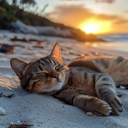

# My First Coding Assignment
 
## About Me
In my free time, I love reading and crocheting. I also the outdoors, where I can unwind and recharge, and spending time with my significant other, Dino, and our cat, Radish. I always remind myself that it's the little things in life that are important.
## Past Coding Experience
While I don't have any experience with Git, GitHub, or VS Code, I do have some experience in HTML and CSS, which I gained while earning my Bachelor's degree in Digital Media. This experience picqued my interest in web and graphic design, and I'm eager to build on these skills in this course.
## Career Goals
My current goals are to:
* Graduate with my Masters
* Successfully transition from a career in higher ed to one in web and graphic design

I'm excited to apply my creativity and communication skills to this new field and continue growing as a designer.